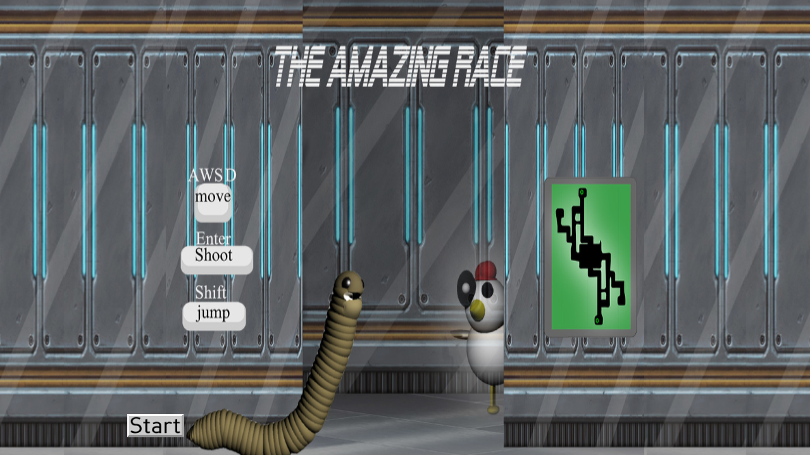
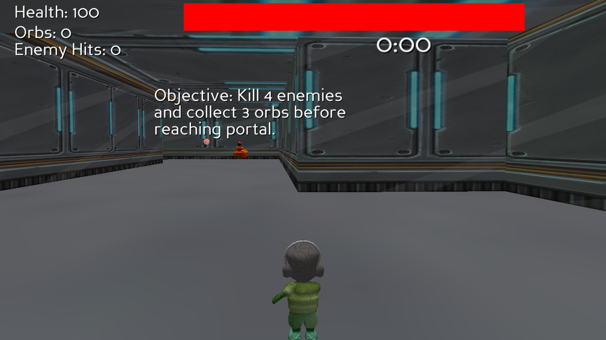
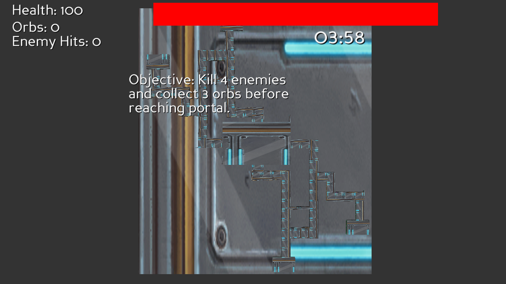

# Phase 1 Notes — Getting the Original Running

Status: **Done.** The game runs on modern macOS (Apple Silicon) with sound, music, and full 3D.

## How to run it

```bash
cd "amazing race 2026"
python3 -m venv .venv
.venv/bin/python -m pip install panda3d
cd TheAmazeingRace
../.venv/bin/python FINALtheamazeingrace.py
```

Press **Start** on the title screen to begin.

## What actually broke (and it was less than expected)

The dependency archaeology the charter braced for mostly didn't materialize.

| Expected problem | Reality |
| --- | --- |
| Old Panda3D version needed | No. Current Panda3D **1.10.16** runs it unmodified. |
| Python 2 → 3 port | **4 lines.** Bare `print` statements — nothing else. No `xrange`, `raw_input`, `has_key`, `iteritems`, integer-division bugs, or `except X, e`. |
| Deprecated Panda3D APIs | None. Every call in `utils.py` and the main file still exists in 1.10.16. |
| Missing assets | None. All 36 `.egg` models, textures, and audio files are present and load. |
| Audio | Works — `.ogg` SFX and the `.mp3` theme both play. |

Remaining console output is cosmetic only: an ffmpeg timestamp warning and a `known incorrect sRGB profile` PNG warning.

Environment used: Python 3.9.6 (system), Panda3D 1.10.16, macOS arm64.

## What the game actually is

A **third-person 3D maze shooter** on a 4-minute timer — not a race in the reality-TV sense.

**Objective:** kill 4 enemies and collect 3 orbs, then reach the portal, before the clock runs out.

**Controls:** `WASD` / arrow keys move (A/D turn, W/S walk), `Enter` shoots, `Space` or `Z` jumps, `Esc` quits.

**HUD:** Health (starts 100), Orbs, Enemy Hits, a `04:00` countdown, and a red health bar.

### Core systems

- **Player** — Panda3D's stock Ralph actor. Turn-and-walk tank controls (turning rotates heading, forward moves along local −Y). Jump uses real gravity (`vz -= 16*dt`). Base speed 60, bumps to 85 briefly on orb pickup, drops back to 60 on wall contact.
- **Camera** — chase cam locked to Ralph's height + 1, always `lookAt` a floater above his head.
- **Maze** — one big `solidfloormazefinal.egg` map: color-themed rooms (earth, yellow, light-blue, red) joined by corridors. The green minimap on the title screen is the real layout.
- **Enemies** — 13 of them, 4 art variants (`cheken`, `chris`, `fetus`, `rose`). Each patrols ±5 units along a fixed X or Y axis at 7 u/s, permanently `lookAt`s the player, and fires a homing-aimed projectile whenever its previous shot has travelled 60+ units. 6 HP, so **7 hits to kill**. Flashes red when hit.
- **Player shots** — a recycled pool of 10 projectiles, fired along Ralph's facing at 25 u/s.
- **Orbs** — 10 placed (red/white/yellow/blue), 3 needed. Collecting one despawns it.
- **Donuts** — 5 health pickups, +15 HP each, capped at 100.
- **Damage** — each enemy projectile is −5 HP; Ralph flashes red for 0.3s. At 0 HP the game-over screen appears.
- **Portal** — a giant rotating eye. Touching it early prints "Not enough orbs." / "Not enough kills."; meeting both gates prints **"You Win"** and freezes the game.
- **Lose conditions** — health hits 0, or the 4:00 timer expires.

## Screenshots

Captured offscreen via a throwaway harness (Panda3D rendering to an offscreen buffer, `win.saveScreenshot`).


*Title screen — controls, the two enemy types on display, and the real maze layout as a minimap.*


*Opening moments: HUD, objective text, and an orb + donut visible down the first corridor.*


*Top-down view of the whole map — it matches the title-screen minimap exactly.*

## Implications for Phase 2

The mechanic set is small and translates cleanly to 2D top-down — which is lucky, because the maze is genuinely a flat 2D floorplan extruded into walls. A top-down Canvas version loses almost nothing structurally:

- Tank controls → top-down 8-way or turn-and-thrust movement
- Chase camera → camera that follows the player over the maze
- Axis-patrolling enemies that aim at the player → trivially portable
- Orbs / donuts / portal gating / timer / health → all 2D-native already

The parts that are genuinely 3D-only: the jump (rarely needed — the maze is flat), the giant-eye portal's rotation, and the room lighting mood.

**Recommendation for Phase 2:** top-down 2D, keep the 4-minute timer, the 3-orbs/4-kills portal gate, and the enemy patrol-and-shoot pattern. That is the game.
